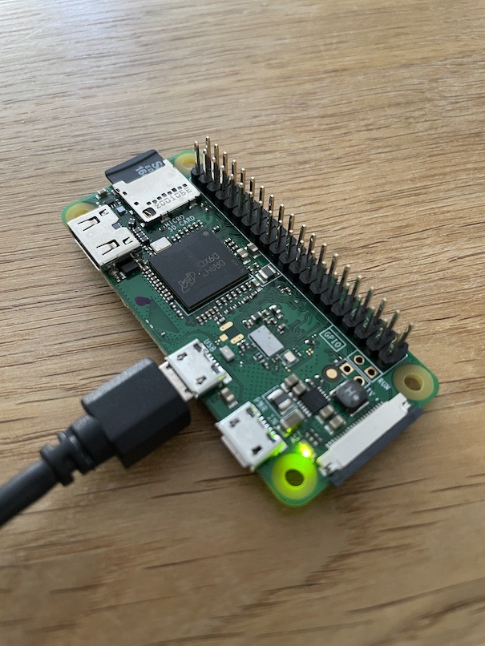
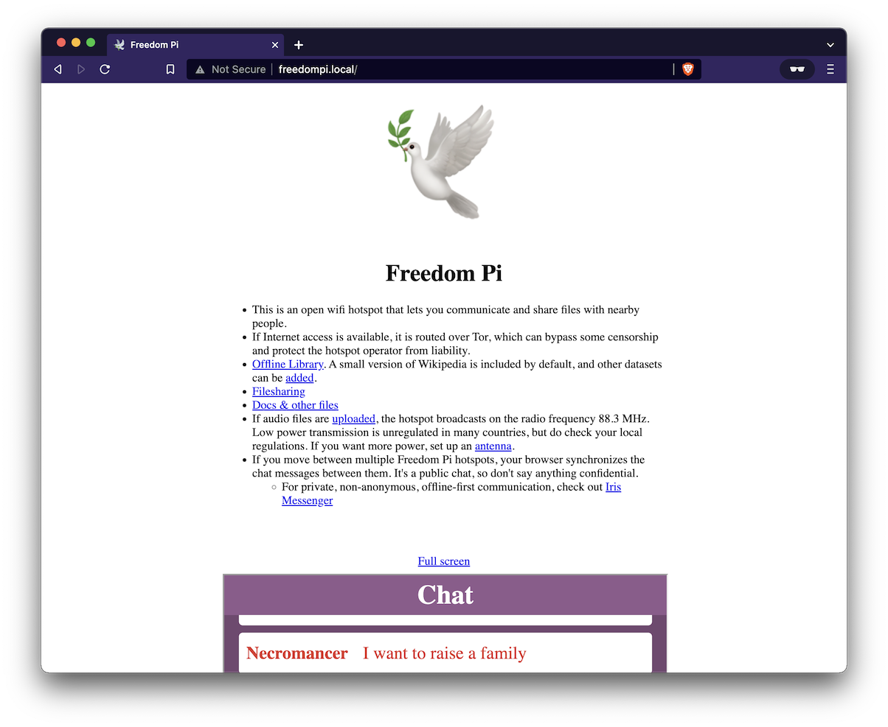

# Freedom Pi
* Raspberry Pi wifi access point
* No configuration required: just insert the SD card and power on your Pi
* Offline-first community portal at freedompi.local
  * Reminded by the wifi name "Open freedompi.local"
  * Chat that synchronizes over the sneaker 👟👟 network when people move between Freedom Pi hotspots
  * Files directory
  * Offline library. English mini version of Wikipedia is included by default. 
* If connected to the Internet via ethernet, external wifi adapter or 4G modem, the connection is shared and routed over Tor. Tor prevents some internet censorship and protects open wifi providers from liability.
* Tools for FM radio broadcasting ([rpitx](https://github.com/F5OEO/rpitx), [fm_transmitter](https://github.com/markondej/fm_transmitter))
  * No additional hardware required: it uses Raspberry Pi's spread spectrum clock signal generator to emit radio frequencies
  * Check your local regulations regarding transmission power and allowed frequencies. Low-power transmission (phone-to-car-radio transmitters) is usually allowed. For more power, you can add a wire antenna to the GPIO 4 port.

*$30 minimal setup: Raspberry Pi Zero W, microSD card and a power supply:*



*Community portal:*



## Installation

Requirements: microSD card, microSD reader, Raspberry Pi, power supply or USB cable. Tested to work on RPi4 and RPi Zero W.

### Using a pre-built image
1. Download a pre-built Freedom Pi image from [releases](https://github.com/mmalmi/FreedomPi/releases) (upcoming)
2. Download [Raspberry Pi Imager](https://www.raspberrypi.com/software/)
3. In Raspberry Pi Imager: Choose OS -> Use custom -> Select the downloaded image.
4. Optional: if you want to manage the Pi over SSH, add an empty file named "ssh" onto the root of the SD card. Remember to change the default password as soon as possible.
5. Insert the SD card into the Pi and power it on.
6. An open wifi network named  "Open freedompi.local" should appear soon. Connect to the network and open [freedom.pi](http://freedom.pi)

### Custom installation
1. Install Raspberry Pi OS Lite onto a microSD card using [Raspberry Pi Imager](https://www.raspberrypi.com/software/). The installation is tested to work with the Debian 11 (bullseye) based Raspberry Pi OS Lite.
2. Enable SSH by adding an empty file named "ssh" onto the SD card root directory. Connect the Pi to your network via ethernet or see instructions for [USB](https://desertbot.io/blog/ssh-into-pi-zero-over-usb) or [wifi](https://www.raspberrypi.com/documentation/computers/configuration.html#setting-up-a-headless-raspberry-pi) setup. For USB, also check out Internet connection sharing ([Macos](https://www.thepolyglotdeveloper.com/2019/07/share-internet-between-macos-raspberry-pi-zero-over-usb/), [Ubuntu](https://help.ubuntu.com/community/Internet/ConnectionSharing) (replace eth0 -> usb0), [Windows](https://www.circuitbasics.com/raspberry-pi-zero-ethernet-gadget/)).
3. Insert the SD card into the Pi and power it on.
4. SSH into the Pi (`ssh pi@raspberrypi.local`) with the default password `raspberry`
```
ssh-keygen -R raspberrypi.local
ssh pi@raspberrypi.local
```
5. Set a secure password using the `passwd` command
6. Download the install script & run. Optionally comment out unwanted components in `install.sh`, or change the hostname (default: freedompi) or wifi country (default: GB) 
```
wget https://raw.githubusercontent.com/mmalmi/FreedomPi/master/install.sh -O install.sh
chmod +x ./install.sh
./install.sh
```
7. An open wifi named "Open freedompi.local" should appear. Connect to the network and open [freedom.pi](http://freedom.pi).

Note that the script changed the hostname. For SSH:
```
ssh-keygen -R freedompi.local
ssh pi@freedompi.local
```

## Documentation
- [Admin access](./public/files/freedom_pi_docs/admin_access.md)
- [Other docs](./public/files/freedom_pi_docs/)

